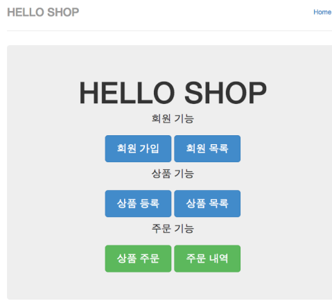

# 0. 예제 프로젝트

## 실전 예제 1 - 요구사항 분석과 기본 매핑

요구사항 분석

---

- 회원은 상품을 주문할 수 있다.
- 주문 시 여러 종류의 상품을 선택할 수 있다.

기능 목록

---

- 회원 기능
    - 회원 등록
    - 회원 조회
- 상품 기능
    - 상품 등록
    - 상품 수정
    - 상품 조회
- 주문 기능
    - 상품 주문
    - 주문 내역 조회
    - 주문 취소

### 도메인 모델 분석

---

- 회원과 주문의 관계: 회원은 여러 번 주문할 수 있다.(일대다)
- 주문과 상품의 관계: 주문할 때 여러 상품을 선택할 수 있다. 반대로 같은 상품도 여러 번 주문될 수 있다. 주문상품 이라는 모델을 만들어서 다대다 관계를 일대다, 다대일 관계로 풀어냄

### 테이블 설계

---

### 엔티티 설계와 매핑

---

### 테이블 중심 설계의 문제점

---

- 현재 방식은 객체 설계를 테이블 설계에 맞춘 방식
- 테이블의 외래키를 객체에 그대로 가져옴
- 객체 그래프 탐색이 불가능
- 참조가 없으므로 UML도 잘못됨

## 실전 예제 - 2. 연관관계 매핑 시작

### 테이블 구조

---

### 객체 구조

---

## 실전 예제 - 3. 다양한 연관관계 매핑

### 배송, 카테고리 추가 - 엔티티

---

- 주문과 배송은 1:1(@OneToOne)
- 상품과 카테고리는 N:M(@ManyToMany)

### 배송, 카테고리 추가 - ERD

---

### 배송, 카테고리 추가 - 엔티티 상세

---

## 실전 예제 - 4. 상속관계 매핑

### 요구사항 추가

---

- 상품의 종류는 음반, 도서, 영화가 있고 이후 더 확장될 수 있다.
    - 상속관계 매핑(@Inheritance)
- 모든 데이터는 등록일과 수정일이 필수다.
    - MappedSuperclass 사용

### 도메인 모델

---

## 실전 예제 - 5.연관관계 관리

### 글로벌 페치 전략 설정

---

- 모든 연관관계를 지연 로딩으로
- @ManyToOne, @OneToOne은 기본이 즉시 로딩이므로 지연 로딩으로 변경

### 영속성 전이 설정

---

- Order -> Delivery를 영속성 전이 ALL 설정
- Order -> OrderItem을 영속성 전이 ALL 설정

## 실전 예제 - 6. 값 타입 매핑

---

