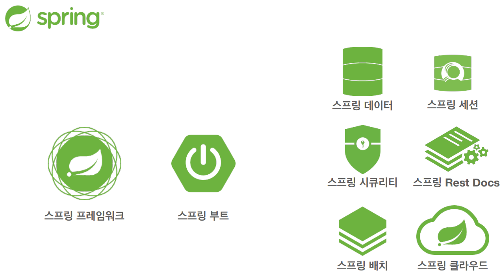

# 객체 지향 설계와 스프링

## 이야기 - 자바 진영의 추운 겨울과 스프링의 탄생

2000년대 초반 자바 진영에 EJB(Enterprise Java Beans)라는 표준 기술이 존재했었는데요. 스프링이나 JPA가 합쳐진 그런 엄청 큰 기술이였습니다. 그런데 EJB를 사용하려면 굉장히 어렵고 무거워서 실제 운영 환경에서 EJB 기반의 프로젝트를 구동하는데도 어려움이 많았다고 합니다. 기술은 너무 좋았지만, 너무 복잡하고 어려운데 너무 느렸으며 너무 비싸다 보니 자바 개발자들이 EJB 사용을 꺼려하게 됐다고 합니다. 그래서 순수한 자바로 돌아가자! 라는 의견이 나오면서 POJO(Plain Old Java Object) 라는 단어가 나오게 됩니다.

EJB에 진절머리가 난 두 명의 개발자 중 한 명인 *로드 존슨*은 EJB보다 훨씬 단순하면서 좋은 방법으로 개발할 수 있도록 2002년 “expert one-on-one J2EE Design and Development”라는 책을 출간하게 됩니다. 이 책이 Spring의 시작입니다. 유겐 휠러와 얀 카로프가 로드 존슨에게 새로운 시작이라는 뜻으로 **Spring**을 ****개발하기 시작합니다. 그리고 또 다른 개발자 개빈 킹은 Hibernate라는 ORM 기술을 개발하게 됩니다.

추운 겨울 EJB에서 따뜻한 봄 Spring으로 자바 진영의 표준 기술이 탄생하게 됩니다.

---

## 스프링이란?

스프링은 여러 기술들의 모음입니다.

스프링의 중심이 되는 스프링 프레임워크. 그리고 여러 기술들을 사용하기 편리하게 만든 스프링 부트 등 여러 프로젝트를 진행하고 있습니다.

**스프링 프레임워크의 핵심기술**

- 핵심 기술: 스프링 DI 컨테이너, AOP, 이벤트, 기타
- 웹 기술: 스프링 MVC, 스프링 WebFlux
- 데이터 접근 기술: 트랜잭션, JDBC, ORM 지원, XML 지원
- 기술 통합: 캐시, 이메일, 원격 접근, 스케줄링
- 테스트: 스프링 기반 테스트 지원
- 언어: 코틀린, 그루비
- 최근에는 스프링 부트를 통해서 스프링 프레임워크의 기술들을 편리하게 사용

**스프링 부트**

- 스프링을 편리하게 사용할 수 있도록 지원, 최근에는 기본으로 사용
- 단독으로 실행할 수 있는 스프링 애플리케이션을 쉽게 생성
- Tomcat 같은 웹 서버를 내장하여 별도의 웹 서버를 설치하지 않아도 됨
- 손쉬운 빌드 구성을 위한 starter 종속성 제공
- 스프링과 3rd party 라이브러리 자동 구성
- 메트릭, 상태 확인, 외부 구성 같은 프로덕션 준비 기능 제공
- 관례에 의한 간결한 설정

### 스프링의 핵심

스프링은 자바 언어 기반의 프레임워크이며, 객체 지향 언어가 가진 강력한 특징을 살려내는 프레임워크입니다. 즉, 좋은 객체 지향 애플리케이션을 개발할 수 있도록 개발자를 도와주는 프레임워크 입니다.

---

## 좋은 객체 지향 프로그래밍이란?

### 객체 지향 특징

- 추상화
- 캡슐화
- 상속
- 다형성

### 객체 지향 프로그래밍

**객체들의 모임**, 객체는 메시지를 주고받고 데이터를 처리할 수 있음(**협력**)

**유연**하고 **변경**이 용이함

### 유연하고, 변경이 용이?

레고 블럭 조립

키보드, 마우스 갈아 끼우기

컴퓨터 부품 바꾸기

컴포넌트를 쉽고 유연하게 변경하면서 개발할 수 있는 방법

⇒다형성(Polymorphism)

### 다형성(Polymorphism)

다형성의 실세계 비유

운전자 - 자동차

공연 무대

키보드 , 마우스, 세상의 표준 인터페이스

정렬 알고리즘

할인 정책 로직

### 세상에서 역할과 구현의 분리

세상이 단순해지고, 유연해지며 변경도 편리해짐.

장점

- 클라이언트는 대상의 역할(인터페이스)만 알면 된다.
- 클라이언트는 구현 대상의 **내부 구조를 몰라도** 된다.
- 클라이언트는 구현 대상의 **내부 구조가 변경**되어도 영향을 받지 않는다.
- 클라이언트는 구현 **대상 자체를 변경**해도 영향을 받지 않는다.

### 자바 언어에서 역할과 구현을 분리

자바 언어의 다형성을 활용

- 역할 = 인터페이스
- 구현 = 인터페이스르 구현한 클래스, 구현 객체

객체를 설계할 때 **역할**과 **구현**을 명확히 분리

객체 설계시 역할(인터페이스)을 먼저 부여하고, 그 역할을 수행하는 구현 객체 만들기

### 객체의 협력이라는 관계부터 생각

혼자있는 객체는 없다

클라이언트: **요청**, 서버: **응답**

수 많은 객체 클라이언트와 객체 서버는 서로 협력 관계를 가진다.

### 자바 언어의 다형성

**오버라이딩**

⇒역할과 구현을 분리함으로써, 유연하고 변경에 용이하게 사용할 수 있다.

왜? 클라이언트는 역할만 알고 있으면 구현이 어떻게 변경되든 역할에게 요청할 수 있으니까.

### 스프링과 객체 지향

IoC, DI 등을 

---

## 좋은 객체 지향 설계의 5가지 원칙(SOLID)

SOLID
클린코드로 유명한 로버트 마틴이 좋은 객체 지향 설계의 5가지 원칙을 정리

### SRP 단일 책임 원칙
Single responsibility principle

한 클래스는 하나의 책임만 가져야 한다.

하나의 책임이라는 것은 모호함

- 클 수 있고, 작을 수 있음
- 문맥과 상황에 따라 다르다

중요한 기준은 변경. 변경이 있을 때 파급효과가 작으면 단일 책임 원칙을 잘 따른 것

### ~~OCP 개방-폐쇄 원칙~~
Open/closed principle

소프트웨어 요소는 **확장에는 열려**있으나 **변경에는 닫혀** 있어야 한다

다형성을 생각해보자.

인터페이스를 구현한 새로운 클래스를 하나 만들어서 새로운 기능을 구현

- 인터페이스를 구현(확장)하지만 인터페이스를 변경하지는 않음

### LSP 리스코프 치환 원칙
Liskov substitution principle

프로그램의 객체는 프로그램의 정확성을 깨뜨리지 않으면서 하위 타입의 인스턴스로 바꿀 수 있어야 한다.

자동차 인스턴스의 악셀 기능을 구현체가 구현을 했는데. A구현체는 앞으로가고 B구현체는 뒤로가면 LSP를 위반한 것이다. 즉, 느리더라도 앞으로 가게 구현을 해야한다는 것이다. 단순히 컴파일에는 성공하는 시나리오를 넘어 개발자들의 구현에 대한 원칙적인 부분을 의미하는 것이다.

### ISP 인터페이스 분리 원칙
Interface segregation principle

특정 클라이언트를 위한 인터페이스 여러 개가 범용 인터페이스 하나보다 낫다

자동차 인터페이스 → 운전 인터페이스, 정비 인터페이스로 분리

사용자 클라이언트 → 운전자 클라이언트, 정비사 클라이언트로 분리

분리하면 정비 인터페이스 자체가 변경되어도 운전자 클라이언트에게 영향을 주지 않음

인터페이스가 명확해지고, 대체 가능성이 높아짐

### ~~DIP 의존관계 역전 원칙~~
Dependency inversion principle

프로그래머는 “추상화에 의존해야지, 구체화에 의존하면 안된다.” 의존성 주입은 이 원칙을 따르는 방법 중 하나다.

쉽게 이야기해서 구현 클래스에 의존하지 말고, 인터페이스에 의존하라는 뜻

클라이언트 코드가 구현체 클래스가 아닌 인터페이스 클래스만 바라봐라....

**역할에 의존하게 해야한다**는 뜻.

---

## 객체 지향 설계와 스프링

### 다시 스프링으로

스프링은 다음 기술로 다형성 + OCP, DIP를 가능하게 지원

- DI(Dependency Injection): 의존관계, 의존성 주입
- DI 컨테이너 제공

[다음으로](2.강의_스프링핵심원리이해1_예제만들기.md)
