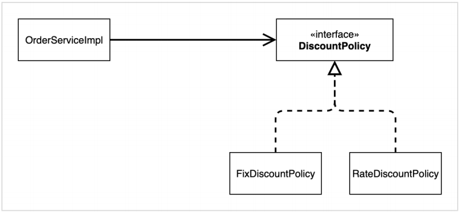

# 스프링 핵심 원리 이해2 - 객체 지향 원리 적용

# 

> 💡 새로운 할인 정책을 확장해보자!

참고: 애자일소프트웨어개발선언 [https://agilemanifesto.org/iso/ko/manifesto.html](https://agilemanifesto.org/iso/ko/manifesto.html)

**고정 할인 정책 → 정률 할인 정책**

할인 정책을 정률 학인 정책으로 변경하려면, `OrderserviceImpl`의 코드를 수정해야 한다.

**문제점**

OCP, DIP 같은 객체 지향 설계 원칙을 준수하지 못함.

DIP : 추상(인터페이스)뿐만 아니라 구체(구현) 클래스에도 의존하고 있음

위의 그림처럼 인터페이스 만을 의존하여 DIP를 준수하고자 했으나,

`FixDiscountPolicy` 또는 `RateDiscountPolicy`를 함께 의존하고 있다. 추상 및 구체에 모두 의존하였다.

**⇒ DIP 위반**

**정책변경**

`FixDiscountPolicy`에서 `RateDiscountPolicy`로 변경하면, `OrderServiceImpl`도 변경해야한다.

즉, 기능을 확장해서 변경을 하면, 클라이언트 코드에 영향을 준다.

**⇒ OCP 위반**

**어떻게 문제를 해결할 수 있을까?**

DIP 위반 → 추상에만 의존하도록 변경(인터페이스에만 의존)

변경하였지만 구체가 존재하지 않아 `discountPolicy`의 메서드를 호출하는 과정에서 NPE가 발생한다.

**해결방안**

누군가 클라이언트인 ‘`OrderserviceImpl`’에 ‘`DiscountPolicy`'의 구현 객체를 대신 주입해주면 된다.

---

## **관심사의 분리**

누군가의 클라이언트에 해당하는 대상은 어떠한 인터페이스의 작업만을 호출한다. 즉 예시로 `MemberServiceImpl` 이 `MemberRepository` 를 통해서, Member를 저장하거나 조회하면 된다. 그  

`MemberRepository`가 `MemoryMemberRepository` 인지, `DBMemberRepository` 인지에 대한 구현체를 알 필요는 없다. 이를 **관심사 분리**라고 한다. 관심사를 분리하기 위해서는 실제 구현체를 주입해줄 수 있는 즉, `MemberserviceImpl` 이 `MemberRepository`를 호출하였을 때, 어떠한 Repository를 사용해줄 것 인지에 대한 대상을 주입해줘야 한다.

의존관계에 대한 주입을 외부(`AppConfig`)에서 수행하여, 관심사를 명확히 분리해준다.

객체의 생성과 연결은 `AppConfig` 가 담당한다.

객체를 생성하고 연결하는 역할과 실행하는 역할이 명확히 분리되었다.

**회원 객체 인스턴스 다이어그램**

`appConfig` 객체는 `memoryMemberRepository` 객체를 생성하고 그 참조값을 `memberServiceImpl` 을 생성하면서 생성자로 전달한다.

클라이언트인 `memberServiceImpl` 입장에서 보면 의존관계를 마치 외부에서 주입해주는 것 같다고 해서 DI(Depedency Injection) 우리말로 **의존관계 주입** 또는 **의존성 주입**이라고 한다.

---

### AppConfig 리팩터링

현재 AppConfig를 보면 ‘중복’이 있고, **역할**에 따른 **구현**이 잘 안보인다.

---

### 새로운 구조와 할인 정책 적용

AppConfig의 등장으로 애플리케이션이 크게 사용 영역과, 객체를 생성하고 구성하는 영역으로 분리되었다.

**사용, 구성의 분리**

**할인 정책의 변경**

구성 영역만 변경하여 실 사용 영역의 내용이 변경되지 않을 상태로 할인 정책을 변경할 수 있다.

---

## 좋은 객체 지향 설계의 5가지 원칙의 적용

위의 예제에서는 SRP, DIP, OCP를 적용

SRP 단일 책임 원칙

한 클래스는 하나의 책임만 가져야 한다.

클라이언트 객체는 직접 구현 객체를 생성하고, 연결하고, 실행하는 다양한 책임을 가지고 있었음 → SRP 위반

SRP 단일 책임 원칙을 따르기 위해 관심사를 분리함

구현 객체를 생성하고 연결하는 책임을 AppConfig가 담당하도록 관심사가 분리됨

클라이언트 객체는 실행하는 책임만 담당하게 됨

DIP 의존관계 역전 원칙

프로그래머는 “추상화에 의존해야지, 구체화에 의존하면 안된다.” 의존성 주입은 이 원칙을 따르는 방법 중 하나다.

새로운 할인 정책(구현)을 개발하고, 이를 사용하려고 하니 클라이언트 코드도 함께 변경해야 했다. 왜냐하면 기존 클라이언트 코드는 DIP를 지키며 `DiscountPolicy` 추상화 인터페이스에 의존하는 것 같았지만, `FixDiscountPolicy` 에 해당하는 구현체도 함께 의존했기 때문이다.

클라이언트 코드가 `DiscountPolicy` 추상화 인터페이스에만 의존하도록 코드를 변경했다.

하지만 클라이언트 코드는 인터페이스만으로는 아무것도 실행할 수 없다.

`AppConfig` 가 `FixDiscountPolicy` 객체 인스턴스를 클라이언트 코드 대신 생성해서 클라이언트 코드에 의존관계를 주입하였다. 이로써 DIP 원칙을 따르면서 문제도 해결되었다.

OCP 개방 폐쇄 원칙

소프트웨어 요소는 확장에는 열려 있으나 변경에는 닫혀 있어야 한다

다형성을 사용하고 클라이언트가 DIP를 지키면 OCP를 지킬 수 있는 가능성이 열림

애플리케이션을 사용 영역과 구성 영역으로 나눔

`AppConfig`가 의존관계를 `FixDiscountPolicy` 에서 `RateDiscountPolicy` 로 변경해서 클라이언트 코드에 주입하므로 클라이언트 코드는 변경하지 않아도 됨

소프트웨어 요소를 **새롭게** **확장**해도 사용 영역의 **변경은 닫혀** 있다.

---

## IoC, DI, 그리고 컨테이너

**제어의 역전 IoC(Inversion of Control)**

기존 프로그램은 클라이언트 코드에서 프로그램의 흐름을 직접 제어하였다. 하지만 AppConfig를 사용하면서 AppConfig가 프로그램의 흐름을 제어하고 실제 클라이언트 코드는 실행의 역할만을 수행하게 되었다. IoC에서 말하는 Control(제어)은 프로그램의 흐름을 제어함을 의미한다. 즉 다시 말해, 기존에 익숙한 흐름인 클라이언트 코드에서 인터페이스의 구현체를 직접 호출하는 형태가 아닌 클라이언트 코드는 어떠한 구현체를 사용할지는 알지 못하고 인터페이스만을 호출하게 된다. 프로그램의 흐름이 어떻게 흘러가는지 클라이언트 코드에서는 알 수가 없다. 왜냐하면 AppConfig가 프로그램의 흐름을 제어하기 때문에.. 이를 제어의 역전이라고 한다.

**의존관계 주입 DI(Dependency Injection)**

OrderServiceImpl 은 DiscountPolicy 인터페이스에만 의존한다. 실제 어떤 구현 객체가 사용될지는 모른다.

**정적인 클래스 의존관계**

클래스가 사용하는 import 코드만 보고 의존관계를 쉽게 판단할 수 있다. 정적인 의존관계는 애플리케이션을 실행하지 않아도 분석할 수 있다.

**동적인 객체 인스턴스 의존 관계**

애플리케이션 실행 시점에 실제 생성된 객체 인스턴스의 참조가 연결된 의존 관계이다.

**스프링 컨테이너**

- `ApplicationContext` 를 스프링 컨테이너라 한다.
- 기존 개발자가 `AppConfig` 를 사용하여 직접 객체를 생성하고 DI를 했지만, 이제부터는 스프링 컨테이너를 통해서 사용한다.
- 스프링 컨테이너는 `@Configuration` 이 붙은 `AppConfig` 를 설정 정보로 사용한다. 여기서 `@Bean` 이라 적힌 메서드를 모두 호출한다. 이렇게 스프링 컨테이너에 등록된 객체를 스프링 빈이라 한다.
- 스프링 빈은 `@Bean` 이 붙은 **메서드 명**을 스프링 빈의 이름으로 사용한다.
- 이러한 스프링 빈은 `applicationContext.getBean(”빈이름”)` 메서드로 사용할 수 있다.
- 기존에는 개발자가 직접 자바코드로 모든 것을 했다면 이제부터는 스프링 컨테이너에 객체를 스프링 빈으로 등록하고, 스프링 컨테이너에서 스프링 빈을 찾아서 사용하도록 변경되었다.