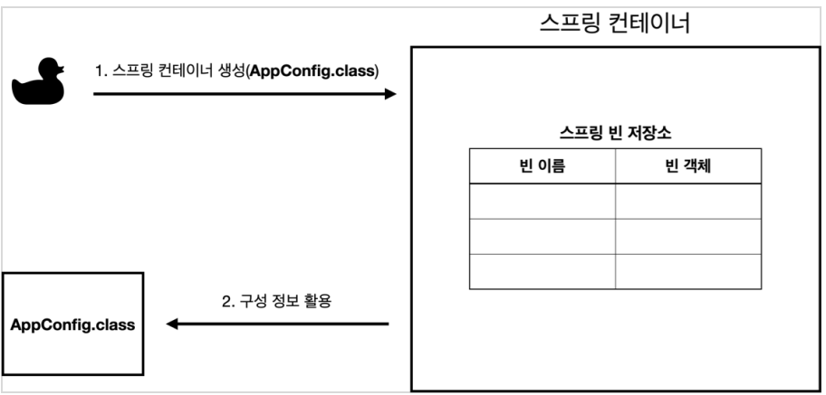

# 스프링 컨테이너와 스프링 빈

## 스프링 컨테이너 생성

스프링 컨테이너가 생성되는 과정을 알아보자.

- `ApplicationContext` 를 스프링 컨테이너라 한다.
- `ApplicationContext` 는 인터페이스이다.
- 스프링 컨테이너는 XML을 기반으로 만들 수 있고, 애노테이션 기반의 자바 설정 클래스로 만들 수 있다.
- 직전에 `AppConfig` 를 사용했던 방식이 애노테이션 기반의 자바 설정 클래스로 스프링 컨테이너를 만든 것이다.
- 자바 설정 클래스를 기반으로 스프링 컨테이너(`ApplicationContext`)를 만들어보자.
    - `new AnnotationConfigApplicationContext(AppConfig.class);`
    - 이 클래스는 `ApplicationContext` 인터페이스의 구현체이다.
    

> 💡 참고: 더 정확히는 스프링 컨테이너를 부를 때 `BeanFactory` , `ApplicationContext` 로 구분해서 이야기한다. 이 부분은 뒤에서 설명한다. `BeanFactory` 를 직접 사용하는 경우는 거의 없으므로 일반적으로 `ApplicationContext` 를 스프링 컨테이너라 한다.

### 1. 스프링 컨테이너의 생성 과정

`new AnnotationConfigApplciationContext(AppConfig.class);`

스프링 컨테이너를 생성할 때는 구성 정보를 지정해주어야 한다.

여기서는 `AppConfig.Class` 를 구성 정보로 지정했다.

### 2. 스프링 빈 등록

스프링 컨테이너는 파라미터로 넘어온 설정 클래스 정보를 사용하여 스프링 빈을 등록한다.

**빈 이름**

빈 이름은 메서드 이름을 사용한다.

빈 이름은 직접 부여할 수도 있다.

`@Bean(name=”memberService2”)`

주의 : 빈 이름은 항상 다름 이름을 부여해야하고 중복되어서는 안된다.

### 3. 스프링 빈 의존관계 설정 - 준비

### 4. 스프링 빈 의존관계 설정 - 완료

- 스프링 컨테이너는 설정 정보를 참고해서 의존관계를 주입(DI)한다.
- 단순히 자바 코드를 호출하는 것 같지만, 차이가 있다. 이 차이는 뒤에 싱글톤 컨테이너에서 설명한다.

**참고**

스프링은 빈을 생성하고, 의존관계를 주입하는 단계가 나누어져 있다. 그런데 자바 코드로 스프링 빈을 등록하면 생성자를 호출하면서 의존관계 주입도 한번에 처리된다. 여기서는 이해를 돕기 위해 개념적으로 나누어 설명했다. 자세한 내용은 의존관계 자동 주입에서 다시 설명하겠다.

**정리**

스프링 컨테이너를 생성하고, 설정(구성) 정보를 참고해서 스프링 빈도 등록하고, 의존관계도 설정했다.

이제 스프링 컨테이너에서 데이터를 조회해보자.

---

## 스프링 빈 조회 - 상속관계

- 부모 타입으로 조회하면, 자식 타입도 함께 조회한다.
- 그래서 모든 자바 객체의 최고 부모인 `Object` 타입으로 조회하면, 모든 스프링 빈을 조회한다.

---

## BeanFactory와 ApplicationContext

beanFactory와 ApplicationContext에 대해 알아보자.

**BeanFactory**

- 스프링 컨테이너의 최상위 인터페이스다.
- 스프링 빈을 관리하고 조회하는 역할을 담당한다.
- `getBean()` 을 제공한다.
- 지금까지 위에서 사용한 대부분의 기능은 BeanFactory가 제공하는 기능이다.

**ApplicationContext**

- BeanFactory 기능을 모두 상속받아서 제공한다.
- 빈을 관리하고 검색하는 기능을 BeanFactory가 제공해주는데, 그러면 둘의 차이가 뭘까?
- 애플리케이션을 개발할 때는 빈은 관리하고 조회하는 기능은 물론이고, 수 많은 부가기능이 필요하다.

MessageSource : 국제화 기능을 담당한다. i18n

Environment : 로컬, 개발, 운영등을 분리해서 개발할 수 있도록 개발 환경을 처리해준다

ApplicationEvent : 이벤트를 발행하고 구독하는 모델을 편리하게 지원한다.

ResourceLoader : 파일, 클래스, 외부 등에서 리소스를 편리하게 조회한다.

---

## 다양한 설정 형식 지원 - 자바 코드, XML

스프링 컨테이너는 다양한 형식의 설정 정보를 받아들일 수 있게 설계되어 있다.

- 자바 코드, XML, Groovy 등등

---

## 스프링 빈 설정 메타 정보 - BeanDefinition

- 스프링은 어떻게 이렇게 다양한 설정 형식을 제원하는 것일까? 그 중심에는 `BeanDefinition` 이라는 추상화가 있다.
- 쉽게 이야기해서 **역할과 구현을 개념적으로 나눈 것** 이다.
    - XML을 읽어서 `BeanDefinition`을 만듦
    - 자바코드를 읽어서 `BeanDefinition`을 만듦
    - 스프링 컨테이너는 자바코드인지 XML인지 몰라도 됨. `BeanDefinition`만 알고 있음
- `BeanDefinition` 을 빈 설정 메타정보라 한다.
    - @Bean, <bean> 당 각각 하나씩 메타 정보가 생성된다.
- 스프링 컨테이너는 이 메타정보를 기반으로 스프링 빈을 생성한다.

