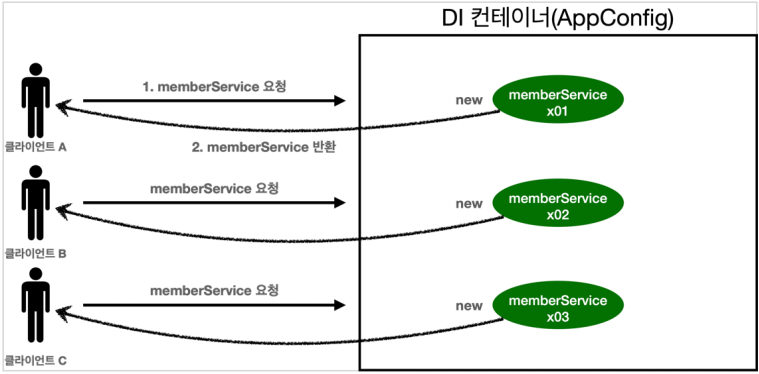

# 싱글톤 컨테이너

## 웹 애플리케이션과 싱글톤

- 스프링은 태생이 기업용 온라인 서비스 기술을 지원하기 위해 탄생했다.
- 대부분의 스프링 애플리케이션은 웹 애플리케이션이다. 물론 웹이 아닌 애플리케이션 개발도 얼마든지 개발할 수 있다.
- 웹 애플리케이션은 보통 여러 고객이 동시에 요청을 한다.



우리가 만들었던 스프링 없는 순수한 DI 컨테이너인 AppConfig는 요청을 할 때 마다 객체를 새로 생성한다.

고객 트래픽이 초당 100이 나오면 초당 100개의 객체가 생성되고 소멸된다! → 메모리 낭비

해당 객체가 딱 1개만 생성되고 이를 공유하도록 설계하여 해결한다. → 싱글톤 패턴

**싱글톤 패턴**

- 클래스의 인스턴스가 딱 1개만 생성되는 것을 보장하는 패턴이다.
- 그래서 객체 인스턴스를 2개 이상 생성하지 못하도록 막아야 한다.
    - PRIVATE 생성자를 사용해서 외부에서 임의로 NEW 키워드를 사용하지 못하도록 막아야 함.


```java
public class SingletonService {

  public static final SingletonService instance = new SingletonService();

  public static SingletonService getInstance() {
    return instance;
  }

  private SingletonService() {

  }
}
```

private으로 생성자 접근을 막았다.

호출할 때 마다 같은 객체 인스턴스를 반환하는 것을 확인할 수 있다.

싱글톤 패턴을 적용하면 고객의 요청이 올때마다 이미 만들어진 객체를 공유해서 효율적으로 사용할 수 있다. 하지만 싱글톤 패턴은 아래의 문제점들을 가지고 있다.

- 싱글톤 패턴의 문제점
    - 싱글톤 패턴을 구현하는 코드 자체가 많이 들어간다.
    - 의존관계상 클라이언트가 구체 클래스에 의존한다 → **DIP를 위반**
    - 클라이언트가 구체 클래스에 의존하기 떄문에 OCP 원칙을 위반할 가능성이 높다
    - 테스트하기 어렵다.
    - 내부 속성을 변경하거나 초기화 하기 어렵다.
    - private 생성자로 자식 클래스를 만들기 어렵다.
    - 즉, 유연성이 떨어진다.
    - 안티패턴으로 불리기도 한다.

⇒ Spring Framework는 위의 문제점을 모두 해결해준다고?!!

## 싱글톤 컨테이너

스프링 컨테이너는 싱글톤 패턴의 문제점을 해결하면ㅁ서, 객체 인스턴스를 싱글톤(1개만 생성)으로 관리한다.

지금까지 우리가 학습한 스프링 빈이 바로 싱글톤으로 관리되는 빈이다.

**싱글톤 컨테이너**

- 스프링 컨테이너는 싱글턴 패턴을 적용하지 않아도, 객체 인스턴스를 싱글톤으로 관리한다.
    - 이전에 설명한 컨테이너 생성 과정을 자세히 보자. 컨테이너는 객체를 하나만 생성해서 관리한다.
- 스프링 컨테이너는 싱글톤 컨테이너 역할을 한다. 이렇게 싱글톤 객체를 생성하고 관리하는 기능을 싱글톤 레지스트리라 한다.
- 스프링 컨테이너의 이런 기능 덕분에 싱글턴 패턴의 모든 단점을 해결하면서 객체를 싱글톤으로 유지할 수 있다.
    - 싱글톤 패턴을 위한 지저분한 코드가 들어가지 않아도 된다.
    - DIP, OCP, 테스트, private 생성자로부터 자유롭게 싱글톤을 사용할 수 있다.
    

**싱글톤 컨테이너 적용 후**


- 스프링 컨테이너 덕분에 고객의 요청이 올 때 마다 객체를 생성하지 않고, 이미 만들어진 객체를 공유해서 효율적으로 재사용할 수 있다.

> 💡 스프링의 기본 빈 등록 방식은 싱글톤이지만, 싱글톤 방식 외에도 요청마다 새로운 객체를 생성하여 반환하는 기능도 제공한다.(빈 스코프에서 추가 설명)


---

## 싱글톤 방식의 주의점

- 싱글톤 패턴이든, 스프링 같은 싱글톤 컨테이너를 사용하든, 객체 인스턴스를 하나만 생성해서 공유하는 싱글톤 방식은 여러 클라이언트가 하나의 같은 객체를 인스턴스를 공유하기 때문에 싱글톤 객체는 상태를 유지(stateful)하게 설계하면 안된다.
- 무상태(stateless)로 설계해야한다!
    - 특정 클라이언트에 의존적인 필드가 있으면 안된다.
    - 특정 클라이언트가 값을 변경할 수 있는 필드가 있으면 안된다!
    - 가급적 읽기만 가능해야 한다.
    - 필드 대신에 자바에서 공유되지 않는, 지역변수, 파라미터, ThreadLocal 등을 사용해야 한다.
- 스프링 빈의 필드에 공유 값을 설정하면 정말 큰 장애가 발생할 수 있다!!!

```java
public class StatefulService {

  private int price;//상태를 유지하는  필드

  public void order(String name, int price) {
    System.out.println("name = " + name + " price = " + price);
    this.price = price;
  }

  public int getPrice() {
    return price;
  }
}
///////////////////////////////////////////////////////////////////////////

class StatefulServiceTest {

  @Test
  void statefulServiceSingleton() {
    ApplicationContext ac = new AnnotationConfigApplicationContext(TestConfig.class);
    StatefulService statefulService1 = ac.getBean(StatefulService.class);
    StatefulService statefulService2 = ac.getBean(StatefulService.class);

    //ThreadA: A 사용자가 10000원을 주문
    statefulService1.order("userA", 10000);
    //ThreadB: B 사용자가 20000원을 주문
    statefulService1.order("userB", 20000);

    //ThreadA: 사용자A가 주문 금액을 조회
    int price = statefulService1.getPrice();
    System.out.println("price = " + price);

    Assertions.assertThat(statefulService1.getPrice()).isEqualTo(20000);
  }

  static class TestConfig {

    @Bean
    public StatefulService statefulService() {
      return new StatefulService();
    }
  }
}
```

- 최대한 단순히 설명하기 위해, 실제 쓰레드는 사용하지 않았다.
- ThreadA가 사용자A 코드를 호출하고 ThreadB가 사용자 B 코드를 호출한다 가정하자.
- `StatefulService`의 `price` 필드는 공유되는 필드인데, 특정 클라이언트가 값을 변경한다.
- 사용자A의 주문 금액은 10000원이 되어야 하는데, 20000원이라는 결과가 나왔다.
- 실무에서 이런 경우를 종종 보는데, 이로 인해 정말 해결하기 어려운 큰 문제들이 터진다.(몇년에 한번씩 꼭 만난다.)
- 진짜 공유필드는 조심해야 한다! 스프링 빈은 항상 무상태(stateless)로 설계하자.

---

## @Configuration과 싱글톤

```java
@Configuration
public class AppConfig {

  @Bean
  public MemberService memberService() {
    return new MemberServiceImpl(memberRepository());
  }

  @Bean
  public MemberRepository memberRepository() {
    return new MemoryMemberRepository();
  }

  @Bean
  public OrderService orderService() {
    return new OrderServiceImpl(memberRepository(), discountPolicy());
  }
...
}
```

- memberService 빈을 만드는 코드를 보면 `memberRepository()` 를 호출한다.
    - 이 메서드를 호출하면 `new MemoryMemberRepository()`를 호출한다.
- orderService 빈을 만드는 코드도 마찬가지로 `memberRepository()` 를 호출한다.
    - 이 메서드를 호출하면 `new MemoryMemberRepository()`를 호출한다.

결과적으로 각각 다른 2개의 `MemoryMemberRepository` 가 생성되면서 싱글톤이 깨지는 것 처럼 보인다. 스프링 컨테이너는 이 문제를 어떻게 해결할까?

```java
public class ConfigurationSingletonTest {

  @Test
  void configurationTest() {
    ApplicationContext ac = new AnnotationConfigApplicationContext(AppConfig.class);

    MemberServiceImpl memberService = ac.getBean("memberService", MemberServiceImpl.class);
    OrderServiceImpl orderService = ac.getBean("orderService", OrderServiceImpl.class);
    MemberRepository memberRepository = ac.getBean("memberRepository", MemberRepository.class);

    MemberRepository memberRepository1 = memberService.getMemberRepository();
    MemberRepository memberRepository2 = orderService.getMemberRepository();

    System.out.println("memberService -> memberRepository = " + memberRepository1);
    System.out.println("orderService -> memberRepository = " + memberRepository2);
    System.out.println("memberRepository = " + memberRepository);

    assertThat(memberService.getMemberRepository()).isSameAs(memberRepository);
    assertThat(orderService.getMemberRepository()).isSameAs(memberRepository);

  }
}
```

확인해보면 memberRepository 인스턴스는 모두 같은 인스턴스가 공유되어 사용된다.

AppConfig의 자바 코드를 보면 분명히 각각 2번 `new MemoryMemberRepository()`가 호출되어서 서로 다른 인스턴스가 생성되어야하는데?

---

## @Configuration과 바이트코드 조작의 마법

스프링 컨테이너는 싱글톤 레지스트리다. 따라서 스프링 빈이 싱글톤이 되도록 보장해주어야 한다. 그런데 스프링이 자바 코드까지 어떻게 하기는 어렵다. 저 자바 코드를 보면 분명 3번 호출되어야 하는 것이 맞다.
그래서 스프링은 클래스의 바이트코드를 조작하는 라이브러리를 사용한다.
모든 비밀은 `@Configuration` 을 적용한 `AppConfig` 에 있다.

```java
@Test
void configurationDeep() {
 ApplicationContext ac = new
AnnotationConfigApplicationContext(AppConfig.class);
 //AppConfig도 스프링 빈으로 등록된다.
 AppConfig bean = ac.getBean(AppConfig.class);

 System.out.println("bean = " + bean.getClass());
 //출력: bean = class hello.core.AppConfig$$EnhancerBySpringCGLIB$$bd479d70
}
```

사실 `AnnotationConfigApplicationContext` 에 파라미터로 넘긴 값은 스프링 빈으로 등록된다. 그래서 `AppConfig` 도 스프링 빈이 된다.
`AppConfig` 스프링 빈을 조회해서 클래스 정보를 출력해보자.

```
bean = class hello.core.AppConfig$$EnhancerBySpringCGLIB$$bd479d70
```

순수한 클래스라면 다음과 같이 출력되어야 한다.
`class hello.core.AppConfig`

그런데 예상과는 다르게 클래스 명에 xxxCGLIB가 붙으면서 상당히 복잡해진 것을 볼 수 있다. 이것은 내가 만든 클래스가 아니라 스프링이 CGLIB라는 바이트코드 조작 라이브러리를 사용해서 AppConfig 클래스를 상속받은 임의의 다른 클래스를 만들고, 그 다른 클래스를 스프링 빈으로 등록한 것이다!


그 임의의 다른 클래스가 바로 싱글톤이 보장되도록 해준다. 아마도 다음과 같이 바이트 코드를 조작해서 작성되어 있을 것이다.(실제로는 CGLIB의 내부 기술을 사용하는데 매우 복잡하다.)

CGLIB 예상 코드

```java
@Bean
public MemberRepository memberRepository() {

 if (memoryMemberRepository가 이미 스프링 컨테이너에 등록되어 있으면?) {
 return 스프링 컨테이너에서 찾아서 반환;
 } else { //스프링 컨테이너에 없으면
 기존 로직을 호출해서 MemoryMemberRepository를 생성하고 스프링 컨테이너에 등록
 return 반환
 }
}
```

- @Bean이 붙은 메서드마다 이미 스프링 빈이 존재하면 존재하는 빈을 반환하고, 스프링 빈이 없으면 생성해서 스프링 빈으로 등록하고 반환하는 코드가 동적으로 만들어진다.
- 덕분에 싱글톤이 보장되는 것이다.

> 💡 AppConfig@CGLIB는 AppConfig의 자식 타입이므로, AppConfig 타입으로 조회 할 수 있다.


`@Configuration` 을 적용하지 않고, `@Bean` 만 적용하면 어떻게 될까?
`@Configuration` 을 붙이면 바이트코드를 조작하는 CGLIB 기술을 사용해서 싱글톤을 보장하지만, 만약 @Bean만 적용하면 어떻게 될까?

⇒ @Bean만 사용해도 스프링 빈으로 등록되지만, 싱글톤을 보장하지 않는다.
⇒ memberRepository() 처럼 의존관계 주입이 필요해서 메서드를 직접 호출할 때 싱글톤을 보장하지
않는다.

⇒ 매번 동일 빈을 호출할 때마다 인스턴스가 새롭게 생성된다.
⇒ 크게 고민할 것이 없다. 스프링 설정 정보는 항상 @Configuration 을 사용하자