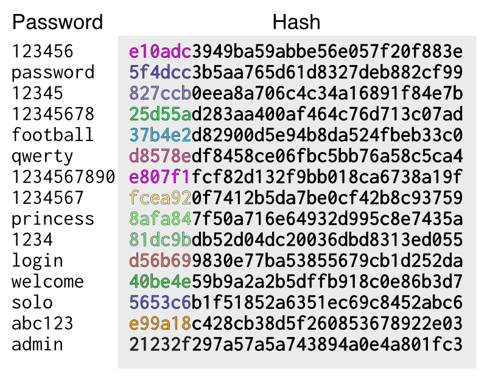
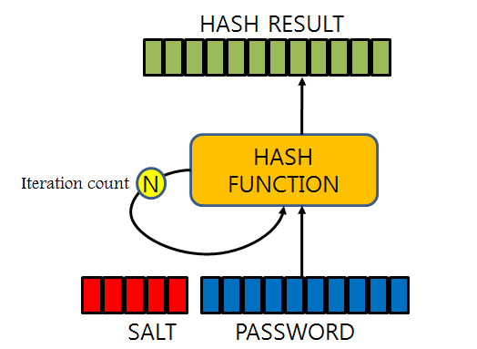
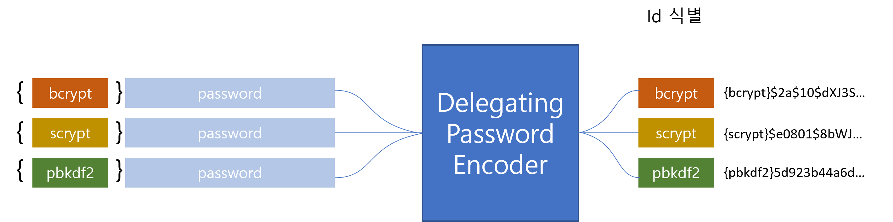

# Password Storage

## 😀 Password Storage History

암호를 저장하는 매커니즘은 수년에 걸쳐 발전해왔습니다. 처음에는 암호를 plaintext(평문)으로 저장하였습니다. 다이터 저장소 암호가 액세스하는 데 필요한 자격 증명에 저장되었기 때문에 평문으로 저장하더라도, 암호가 안전하게 저장되었을 거라고 판단했습니다. 그러나 악의적인 사용자(해커)가 SQL Injection과 같은 공격을 사용하여 사용자 이름과 암호 데이터를 “data dump”를 통해 얻을 수 있는 취약점이 발견되었습니다.

이후, SHA-256과 같은 단방향 해시를 통해 암호를 저장할 때, 해시 처리하여 저장하도록 권장하였습니다. 사용자가 인증을 시도하면 암호와 해시처리된 암호와 비교하여 인증을 처리하는 방식이었습니다.  단방향 해시를 통해 저장된 비밀번호를 탈취하더라도 해시값만 가지고는 비밀번호를 추측할 수 없을 것이라 판단했습니다. 하지만 해커는 이런 시스템을 대응하기 위해, Rainbow Table로 알려진 Lookup Tableㅇ르 만들기 시작했습니다. 매번 비밀번호를 추측하는 대신, 비밀번호를 미리 계산해 룩업 테이블에 저장한 것입니다.



[Rainbow Table의 예시]([https://analogist.net/post/a-non-technical-history-of-password-storage/](https://analogist.net/post/a-non-technical-history-of-password-storage/))

Rainbow Table을 무력화하기 위한 방법으로 개발자들은 Salted Password를 사용하기 시작했습니다. 비밀번호를 해시 함수를 통해 해시화 하는 것에 추가적으로 임의의 바이트(salt)를 생성하여 이를 대입해 비밀번호를 관리하는 것입니다. 고유한 salt와 비밀번호 조합으로 매번 해시값이 달라지기 때문에 더이상 Rainbow Table을 사용할 수 없게되었습니다.



[SALT 암호화 예시]([https://d2.naver.com/helloworld/318732](https://d2.naver.com/helloworld/318732))

현대에서는 이를 더 강화하기 위해, 적응형 단방향 함수 (adaptive one-way function)로 비밀번호를 저장하는 것이 좋습니다. 적응형 단방향 함수는 많은 리소스를 소모하여 비밀번호를 검증하기는 하지만, 워크 팩터(work factor)를 지정하여 비밀번호를 보다 암호의 강도를 높히는 방법입니다.(`bcrypt`, `PBKDF2`, `scrypt`, `argon2`)

> 💡 Spring Security에서는 워크 팩터를 어떻게 지정하는지는 확인이 필요하나, 필자는 기존 host의 고유 하드웨어 정보(이를테면, MAC Addr)를 조합하여 워크 팩터를 지정하기도 했습니다.

적응형 단방향 함수의 경우, 앞서 언급한 바와 같이, 많은 리소스를 소모하여 비밀번호를 검증하기 때문에, 여러번의 인증시도에 대해 리소스 부하(애플리케이션 성능 저하 유발)가 발생할 수 있습니다. 보안 성능을 확보하기 위해, 해당 리소스 부하를 해결할 수는 없습니다. 사용자는 장기 자격 증명(Password-authentication)을 단기 자격 증명(OAuth 등)으로 바꿔 인증을 제공하는 편이 더 나을 수 있습니다.

## 😀 DelgatingPasswordEncoder

Spring Security 5.0이전에는 기본 텍스트를 저장(`NoOpPasswordEncoder`)하는 것이 일반적인 `PasswordEncoder`였습니다.

물론, 위의 History 절과 같이 현대에는 더 나은 PasswordEncoder를 제공하고있습니다. 하지만, 단순히 기존 패스워드 저장 매커니즘을 통해 저장된 비밀번호를 현재 수준으로 Migration하는 등의 어려운 작업들로 인해, 아직도 `NoOpPasswordEncoder`를 사용하고있는 애플리케이션들이 존재합니다.

이 DelgatingPasswordEncoder는 이러한 문제점들을 해결하기 위해 아래와 같은 목적을 가지고 있습니다.

- 비밀번호를 현재 권장하는 저장 방식으로 인코딩함을 보장한다.
- 비밀번호 검증은 최신 형식과 레거시 형식을 모두 지원한다.
- 향후 인코딩을 변경할 수 있다.

`DelegatingPasswordEncoder`는 `PasswordEncoderFactories`를 사용하여 쉽게 만들 수 있습니다.

```java
PasswordEncoder passwordEncoder = 
	PasswordEncoderFactories.createDelegatatingPasswordEncoder();
```

필요에 따라, 커스텀하게 인스턴스를 생성할 수도 있습니다.

```java
String idForEncode = "bcrypt";
Map encoders = new HashMap<>();
encoders.put(idForEncode, new BCryptPasswordEncoder());
encoders.put("noop", NoOpPasswordEncoder.getInstance());
encoders.put("pbkdf2", new Pbkdf2PasswordEncoder());
encoders.put("scrypt", new SCryptPasswordEncoder());
encoders.put("sha256", new StandardPasswordEncoder());

PasswordEncoder passwordEncoder =
    new DelegatingPasswordEncoder(idForEncode, encoders);
```

### Password Storage Format

DelegatingPasswordEncoder의 패스워드 포멧은 아래와 같습니다:

```
{id}encodedPassword
```

`id` 는 어떤 `PasswordEncoder`를 사용한 값인지를 식별하는 용도이고, `encodedPassword`는 선택된 `PasswordEncoder`를 통해 Encoding 된 값입니다. id는 반드시 Encoding된 비밀번호의 앞에 위치해야합니다. 만약 id가 작성되지 않았다면, id는 null 값이 들어가게 됩니다.

위의 값이 저장되면, `id`가 그대로 노출되어 위험한 것이 아닌지 걱정할 수 있는데, 비밀번호 저장은 어떤 `PasswordEncoder`를 사용했는지와는 별개의 문제이기 때문에 걱정하지 않아도 됩니다. 또한, prefix가 없어도 포맷을 대부분 쉽게 알아낼 수 있기 때문에 사실 노출되어도 문제는 없는 값입니다.

이를테면, BCrypt는 보통 `$2a$`로 시작합니다.

### Password Encoding

생성자로 전달된 idForEncode가 비밀번호를 인코딩할 때 사용할 PasswordEncoder를 의사결정합니다. DelegatingPasswordEncoder에서는 전달된 인자에 따라, 프리픽스를 확인하고, 해당 프리픽스에 해당하는 PasswordEncoder로 인코딩을 위임합니다.

```java
String encodedPassword = PasswordEncoder.encode(”Password”);
```



### Password Matching

Matching도 마찬가지로 id를 기반으로 어떤 PasswordEncoder를 사용해야하는지를 식별합니다. id를 식별할 수 없는 경우 죽, `id` 값이 `null` 이거나 맵핑할 수 없는 경우 `IllegalArgumentException`이 발생합니다. id 값이 없는 경우를 `DelegatingPasswordEncoder.setDefaultPasswordEncoderForMatches(PasswordEncoder)` 메서드를 사용하여, 기본값으로 대체할 수 있습니다.