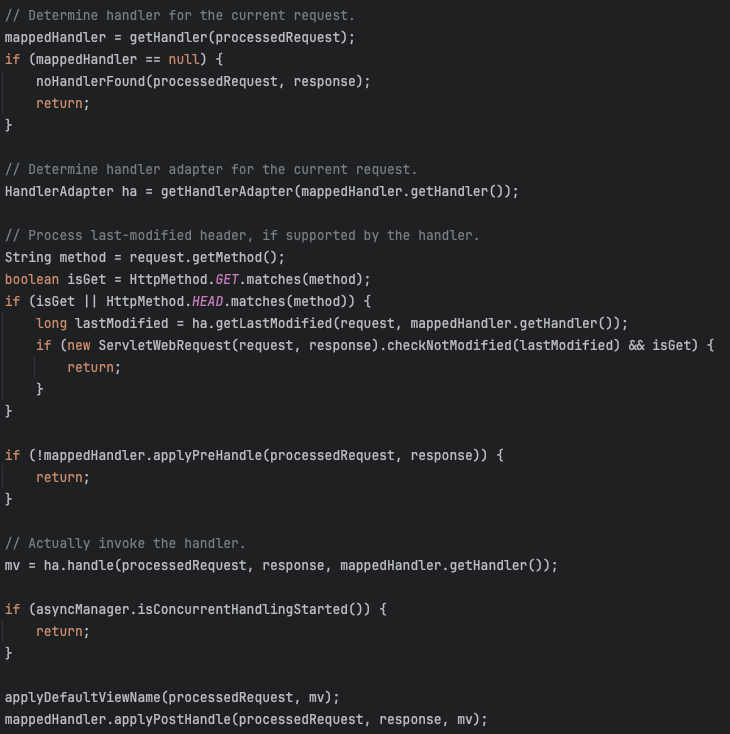
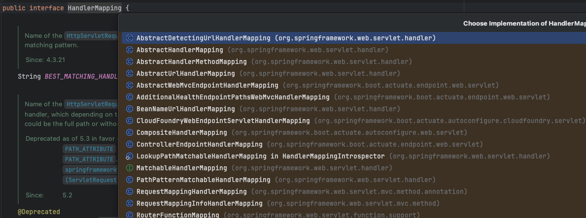
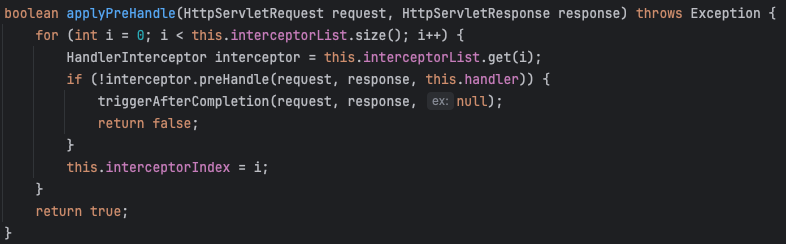

# HTTP 요청 흐름에 대하여

## IO -> Catalina -> ServletFilter -> DelegatingFilterProxy -> SecurityFilterChain

사용자 브라우저에서 HTTP 요청이 서버로 전달되면, 해당 포트를 리스닝 중인 WAS의 Socket I/O 모듈이 요청 바이트 스트림을 전달받는다.

이 페이지에서는 일반적으로 가장 많이 사용하는 WAS인 `Tomcat`을 기준으로 요청 흐름을 설명한다.

Tomcat에서는 이 Socket I/O 처리와 HTTP 요청 파싱을 Coyote(Connector) 컴포넌트가 담당한다.

이 커넥터 역할을 담당하는 Coyote는 HTTP 요청 바이트 스트림을 파싱하여 Request/Response 객체로 변환하고, 이를 Servlet Container에게 전달한다.

여기서 Servlet Container는 `Catalina`라는 주요 컴포넌트를 의미한다. Catalina는 최종적으로 요청을 Servlet에게 전달하기 전에,

내부 Pipeline/Value 구조를 통해 Servlet 스펙에 따라 구성된 ApplicationFilterChain을 실행하여 등록된 Filter들을 순서대로 수행한다.

이때 Chaining된 여러 Filter 들이 해당 요청이 필터링 대상인지를 검증한다. 그래서 흔히 FilterChain이라는 용어를 사용한다.

절차적으로 사슬화된 Filter를 하나씩 해결하면서 사슬에 물려있는 Filter들의 필터링을 수행하는 것이다.

Spring Security와 Tomcat이 서로 맞물리는 구간이 바로 Tomcat 의 FilterChain을 수행하는 과정에서 생긴다.

정확하게는, Tomcat FilterChain 내부에 DelegatingFilterProxy가 하나의 표준 ServletFilter로 등록되어 이 DelegatingFilterProxy가

Spring Security의 SpringSecurityFilterChain을 실행한다.

간략화해서 이해해보면
> Browser -> HTTP Request(bytes) -> Coyote(Connector):: parse to Request/Response -> Catalina(Engine -> Host -> Context -> Wrapper)
-> ApplicationFilterChain -> DelegatingFilterProxy -> Spring SecurityFilterChain -> Servlet

와 같은형태로 수행한다.

Spring SecurityFilterChain은 여러 SecurityFilter를 순차적으로 적용하며, 인증/인가 로직을 모두 통과한 요청만 Servlet으로 넘어가게 된다.

---

## ApplicationFilterChain -> DispatcherServlet -> HandlerMapping(getHandler) -> HandlerAdapter 선택(getHandlerAdapter) -> interceptor.preHandle() -> HandlerAdapter.handle() 내부에서 resolve Argument -> method.invoke()

실제로 SecurityFilterChain을 통과하면 Tomcat ApplicationFilterChain의 마지막 단계로 DispatcherServlet을 호출한다.

HttpServletRequest와 HttpServletResponse를 전달받은 DispatcherServlet은 이 요청을 누구에게 전달해야할지, 그리고 요청을 어떻게 가공해서 전달해야할지를 의사결정한다.

그때 수행되는 단계가 HandlerMapping 과 ArgumentResolve 단계이다.

### Handler Mapping

DispatcherServlet은 `getHandler()`를 통해 Dispatcher Servlet이 보유한 여러 HandlerMapping 빈에게 직접 요청을 전달하며,

순차적으로 매핑을 찾는다. (아래는 DispatcherServlet이 관리하는 여러 HandlerMapping 구현체들이다.)

위의 HandlerMapping 구현체들이 직접 URL 패턴과 요청 메서드 등을 비교해서 실제로 호출해야할 컨트롤러와 인터셉터 묶음(HandlerExecutionChain)을 반환한다.

### Handler Adapter

HandlerExecutionChain 안에는 핸들러 객체에 해당하는 컨트롤러가 포함되어 있는데, 어떠한 타입인지에 따라 어떤 어댑터를 사용할지 의사결정한다.

핸들러 타입판별을 위해 supports() 와 실제로 컨트롤러를 호출하는 handle() 로 구성되어있다.

이제 어느 컨트롤러에 어느 어댑터를 사용해서 전달할 것인지가 의사결정 되었다.

### Interceptor preHandler

만약 해당 요청을 수행할 컨트롤러 대상이 수행할 Interceptor preHandle()이 존재하면 수행한다.

이때 수행해야할 Interceptor는 앞서 Handler Mapping에서 이미 어떤 인터셉터가 붙을지 결정되어있다.

단순히 결정되어있는 Interceptor를 순차적으로 prehandle()을 수행한다.

### ArgumentResolver

선택된 Handler Adapter가 handle()메서드를 수행하면 본격적으로 핸들링을 수행하는데, 이때 ArgumentResolver가 개입되어,

Request로부터 추출한 파라미터 갯수만큼 풀어내고 이를 객체화한다. 사용자 요청의 정보를 적합한 형태로 반환한다.

정확히는 adapter.handle() 을 호출하면, `invokeHandlerMethod()`를 통해 `invokeAndHandle()`를 수행한다.

이 InvokeAndHandle()에서 내부적으로 `getMethodArgumentValues()` 가 호출되어 Controller에게 invoke 할 정보를 획득한다.

이때 PathVariable이라면, PathVariableMethodArgumentResolver가 개입되고,

RequestBody 라면, HttpMessageConverter를 사용하는 RequestResponseBodyMethodProcessor가 개입된다.(실제 파싱은 JacksonHttpMessageConverter가)

### method.invoke()

이제야 실제로 Controller로 진입하고 작업을 수행하고 수행결과를 Controller에서 반환한다.

## ReturnValueHandler ->  Interceptor.postHandle -> View Rendering OR Json Serialization -> Interceptor.afterCompletion()

### ReturnValueHandler (결과 처리 단계)
응답결과를 받은 "HandlerAdapter"는 ReturnValueHandler에게 작업을 위임해 리턴값을 HTTP 응답 형태로 변환한다.

이 ReturnValueHandler는 응답결과의 형상에 따라 View를 반환하거나 RequestResponseBodyMethodProcessor 사용하여 Json Serialization을 수행하는 작업을 의사결정한다.

결과가 "String" 형태라면, ViewResolver를 통해 그에 맞는 템플릿을 랜더링하고

결과가 ModelAndView 라면, ViewResolver를 통해 처리

결과가 ResponseEntity 형태라면, HttpEntityMethodProcessor가 직접 바디를 처리한다.

### Interceptor.postHandle
HTML기반 응답이라면 ModelAndView를 조작할 수 있다.

컨트롤러 로직 이후, 응답 렌더링 직전에 개입하는 훅 역할을 수행한다.

### View Rendering Or Json Serialization
@Controller에서 반환한 view name(String)은 ViewResolver가 view 이름을 해석해서 템플릿 엔진에서 HTML을 렌더링한 후, Response body에 HTML을 작성하여 반환한다.

만약 @RestController / @ResponseBody 라면 HttpMessageConverter가 실행되어 객체를 JSON으로 직렬화한뒤 Response body에 JSON을 작성하여 반환한다.

### Interceptor.afterCompletion()
요청이 전부 마무리되면, afterCompletion()이 실행된다.(물론 인터셉터가 있다는 전제로)

혹시나 Controller 로직에서 예외가 발생하더라도 인터셉터의 afterCompletion 단계는 반드시 수행된다.

## Tomcat -> Response (응답 Flush)
DispatcherServlet.service() -> DispatcherServlet.doDispatch() 가 모두 완료되고, 이제 Tomcat 서블릿 엔진이 응답을 마무리하는단계이다.

이과정은 Spring MVC 영역을 벗어나, Tomcat의 영역에 해당한다.

## 브라우저로 전달하기

DispatcherServlet이 생성한 응답결과는 HttpServletResponse 내부의 OutputStream/Writer에 작성되어있다.

이 작성된 응답버퍼를 확인하고 HTTP 응답헤더와 바디를 Coyote가 실제 IO 소켓 채널로 flush 한다.

그러면 최종적으로 TCP 계층을 통해 클라이언트 브라우저로 전달된다.